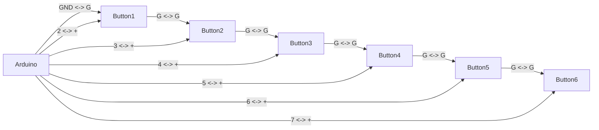

# passwordKeyboard by Nicek

### Schema of connection buttons to arduino:

```mermaid
graph LR
A[Arduino] -- GND <-> G --> B[Button1]
A[Arduino] -- 2 <-> + --> B[Button1]
B[Button1] -- G <-> G --> C[Button2]
A[Arduino] -- 3 <-> + --> C[Button2]
C[Button2] -- G <-> G --> D[Button3]
A[Arduino] -- 4 <-> + --> D[Button3]
D[Button3] -- G <-> G --> E[Button4]
A[Arduino] -- 5 <-> + --> E[Button4]
E[Button4] -- G <-> G --> F[Button5]
A[Arduino] -- 6 <-> + --> F[Button5]
F[Button5] -- G <-> G --> G[Button6]
A[Arduino] -- 7 <-> + --> G[Button6]
```

